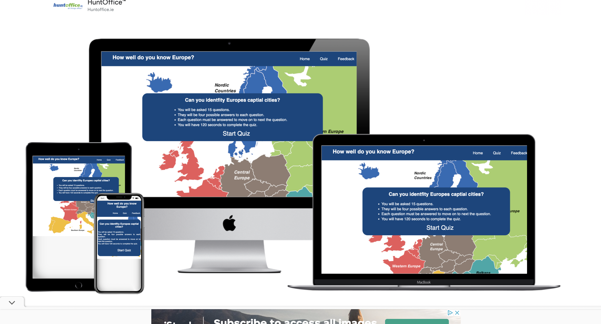
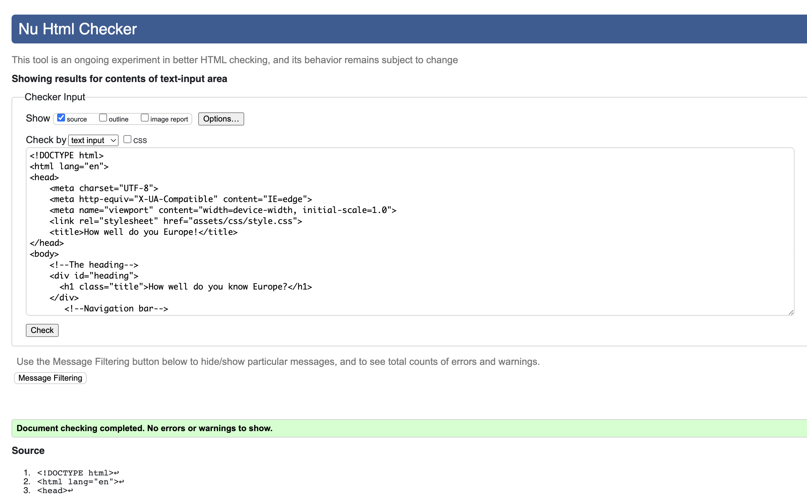
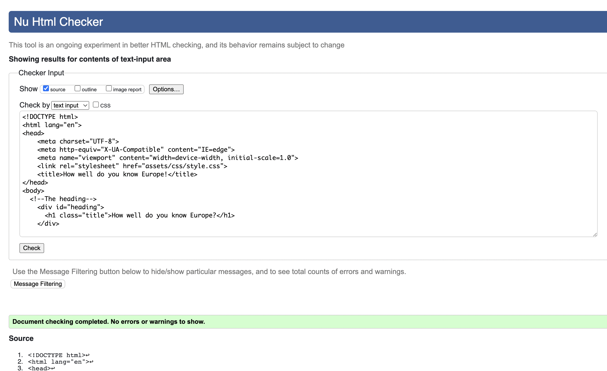
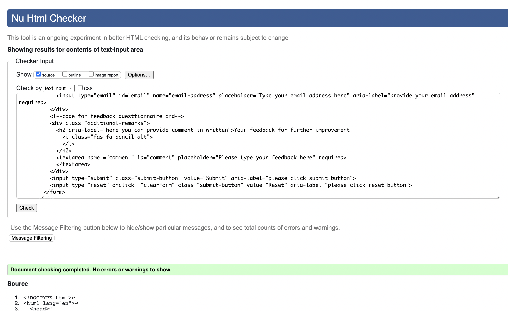
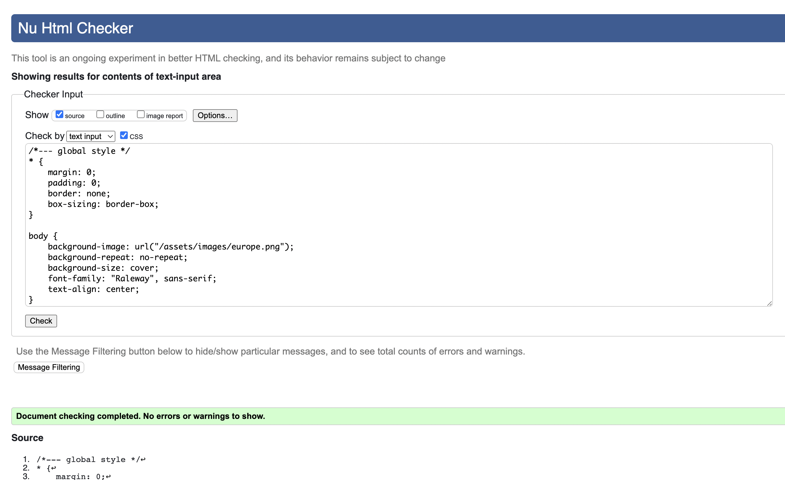

# Quiz on the capital cities of Europe

## Introduction 
This project is aimed to design the online quiz app which allows to test the knowledge we have on the capitals of Europe. There is three pages the first being the quiz rules and a button which when clicked brings you to start of quiz, second being the quiz and the third being a feedback page which gives the user a chance to give their opinion on any changes they might want to see.

A live website can be found [here](https://cathalshandon.github.io/Project-2/)

# Table of Contents
[1. User Expereince (UX) design](#ux)
  - [User Goals:](#user-goals)
  - [User Expectations:](#user-expectations)
  - [Site skeleton (wireframes)](#wireframes)
    - [Home page](#home-page)
    - [Quiz page](#quiz-page)
    - [Feedback page](#feedback-page)

      
  [2. Features](#features)

  [3.Technologies used](#technologies-used)

  [4.Testing](#testing)

  [5.Bugs](#bugs)

  [6. Deployment](#deployment)

  [7. Acknowledgement](#acknowledgement)

# 1. User Expereince (UX) design
  [Go to the top](#table-of-contents)

  
## 1.1 User Goals
  [Go to the top](#table-of-contents)

  The main goal of this project is to develop a quiz that tests the users knowledge of how well they know europe and the captial cities of europe.

  
## 1.2 User Expectations
  [Go to the top](#table-of-contents)

  The quiz provides 15 mutiple choice questions which the option of 4 different answers.
  * The website is designed to be simple and easy to use. 
  * The user interface is easy to navigate including navigation bar and a link on the home page that with one click brings you to the start of the quiz.
  * The website also has a timer so the user has to complete the quiz in that timeframe.
  * When the user picks an answer if the answer is correct it with show green in background and if it is incorrect it will show red in background.
  * When the user completes the quiz it will show thier final score and with an option to retry the quiz or to go into feedback page.
  * It is responsive to all screen/devices like mobile, tablet and desktop.
  * Feedback page provides user a chance to provide their opuion for futher improvements.

## 1.3 Site Skeleton
  [Go to the top](#table-of-contents)

### Home Page

### Quiz Page

### Feedback Page

  
# 2. Features
  [Go to the top](#table-of-contents)

  ### Home page: 
  - The home page has a tile of "How well do you know Europe" and a navigation bar at the top right hand corner with a hover effect that turn green.
  - There is a text box with the title "Can you identify Europes captial cities?".
  - There is also four rules that explains that there is 15 questions in the quiz.
  - That there is four options for every questions.
  - Each question has to be answered to move onto next.
  - The user has 120 seconds to complete the quiz.
  - There is also a button you can click that will bring to the start of the quiz.

  The screenshot of home page is below:
  

  ### Quiz page:
   - The quiz page has a tile of "How well do you know Europe" and a navigation bar at the top right hand corner with a hover effect that turn green.
  - When the user goes into the quiz page the quiz starts.
  - There is timer up the top of quiz couting down from 120 seconds.
  - Question is displayed with four options to choose from underneath.
  - Under the four options it tells the user what questions they are on.
  - There is also a button which gives you the option of restarting the quiz.

The screenshot is below:

Screenshot of the scorecard

  ### Feedback page:
  - Include contact form that provides the user the ability to provide comments and feedback about the quiz. 
  - Provide Submit and Reset buttons with a hoever effect on it
  - The form use the method="POST" action="https://formdump.codeinstitute.net/"
  - I use the option of placeholder for full name and email address.
  - If the user tries to submit the form without any message a pop up will appear to alert user to provide feedback.

  The screenshot of feedback page is below:

 The feedback form was correctly submitted  as  shown below.
 
  
# 3. Technologies Used
  [Go to the top](#table-of-contents)

* [HTML5](https://en.wikipedia.org/wiki/HTML5) (markup language) was used for structuring and presenting content of the website.
 * [CSS3](https://en.wikipedia.org/wiki/CSS) (Cascading Style Sheets) was used to provide the style to the content written in a HTML.
* [JavaScript](https://en.wikipedia.org/wiki/JavaScript) was used to make the developed quiz more interactive, add dynamic behavior and special effects.
* [Balsamiq](https://balsamiq.com/) was used to create wireframes of the website (desktop and mobile version).
* [Chrome](https://www.google.com/intl/en_uk/chrome/) was used to debug and test the source code using HTML5 as well as to test site responsiveness.
* [Github](https://github.com/) was used to create the repository and to store the cproject's code after pushed from Git.
* [Gitpod](https://www.gitpod.io/) was used as the Code Editor for the site.
* [W3C Markup](https://validator.w3.org/) tool was used to validate the HTML code  used in the proejct.

# 4. Testing
  [Go to the top](#table-of-contents)
 
  ## 4.1. Google Developer Tools
  I used google dev tools as debugging tools. Any element that was added in gitpod and inspected and debugged until I was happy.

  ## 4.2 W3C Validator Tools

  ## 4.3 Manual Testing

  I have tested my site on multiple devices. These include:
  - iPhone 6/7/8 (375 x 667) 
  - iPhone 6/7/8 plus (414 x 736)
  - ipad (768 x 1024)
  - iPhone XS Max
  - iPad Pro (1024 x 1366)
  - Pixel 5

  Please find below my testing process for all pages via mobile and web:
 ## All 3 pages:
 ### Navigation bars

 TEST            | OUTCOME                          | PASS / FAIL  
--------------- | -------------------------------- | ---------------
Home page | on click to "Home", the browser redirects me to the home page. The hoever effect (green rectangular box) appears when mouse is on "home".| PASS
Quiz page | on click to "quiz", the browser redirects me to the quiz page. The hoever effect (green rectangular box) appears when mouse is on "quiz". | PASS
Feedback page| on click to "feedback page", the browser redirects me to the feedback page. The hoever effect (green rectangular box) appears when mouse is on "feedback page". | PASS
Responsive | All pages and elements were responsive (mobile and website) using differnt breakpoints.| PASS
Foreground & background  color| Checked foreground information is not distracted by backgrounds| PASS
Text|Checked if all fonts and colors used are consistent or not|PASS

### Home page
TEST            | OUTCOME                          | PASS / FAIL  
--------------- | -------------------------------- | ---------------
Responsive | Responsive of the page in differnce screen sizes (mobile and website) using differnt breakpoints were checked.| PASS
Start-Quiz tab | Checked if after clicking the Start-quiz redirect to the quiz page or not| PASS
Accessibility | Checked the accessibility of the page using lighthouse| PASS

### Quiz page
TEST            | OUTCOME                          | PASS / FAIL  
--------------- | -------------------------------- | ---------------
Timer|Checked if timer is displaying correctly or not and when clicked to try again button if it is reset to original 120 sec or not|PASS
Hiding of previous questions | Checked when clicked when a answer is choosen, the previous question box dissapear or not|PASS
Score card|Checked if the correct score is given after completing the quiz| PASS
Retry quiz|Checked when clicked retry quiz button, it will redirect to first question or not| PASS
Responsive | Responsive of the page in differnce screen sizes (mobile and website) using differnt breakpoints were checked.| PASS
Accessibility | Checked the accessibility of the page using lighthouse| PASS

### Feedback page
TEST            | OUTCOME                          | PASS / FAIL  
--------------- | -------------------------------- | ---------------
Responsive | Responsive of the page in differnce screen sizes (mobile and website) using differnt breakpoints were checked.| PASS
Submit/Reset| Checked if submit and reset button works or not|PASS
Placeholder| Checked if placeholder on the full name, email addres and text box works or not|PASS
Accessibility | Checked the accessibility of the page using lighthouse| PASS

# 5. Bugs
  [Go to the top](#table-of-contents)

### Solved bugs
  - I discovered missing semicolon in several lines of javascript code which was solved after validation with Jshint.
  - When I deployed my website on github the backround image wasn't showing with url("/assets/images/europe.png"); so instead i changed it to - url("../images/europe.png"); and it then displayed.

  
# 6. Deployment
  [Go to the top](#table-of-contents)

The site was deployed to GitHub pages using the following steps:
- Sign up to GutHub
- Create a new repository on GitHub.
- Click on settings on the navigation bar under the repository title.
- Select pages on the left menu bar.
- Click on the master branch and save.
- This will now generate a link with your website live.
- The live link can be found here - (https://cathalshandon.github.io/Project-2/)

  
# 7. Acknowledgement
  [Go to the top](#table-of-contents)
  
  ### Code
  - The navigation bar came from the love running project
  - Coding for feedback.html page was inspired from differnt tutorial from https://codeinstitute.net/ 
  - For README.md file, reference from my first project was considered. 
  
